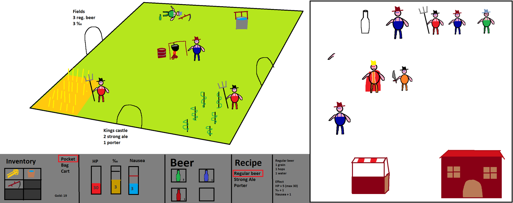
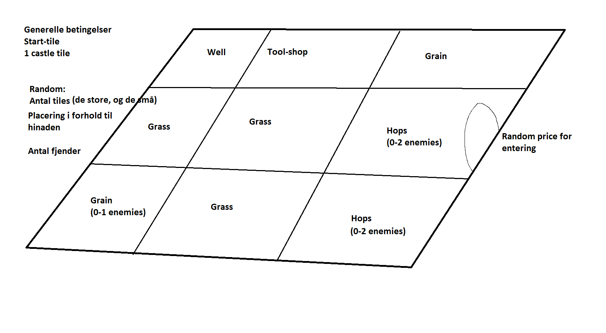

# "Unnamed game"

## Synopsis
The kingdom has become unstable after the king banned beer. Riots are common, and a few brave peasants risks their lives every day to supply the thirsty population.

## Map concept
The full map is divided into sectors. Each sector is a X\*Y grid of tiles that each has different properties.

Travelling between sectors can be done through portals in the middle of each side. Access to these might need to be unlocked at some cost.

### Tiles

- Grass: Empty tile that has no inherent value.
- Field: Barley grows here that can be harvested. But there will probably be a farmer nearby that will be protective off it.
- Hops field: Same as the field, but with hops.
- Well: Provides water
- Tavern: Place to go for selling beer, or finding shady characters
- Castle wall/gate: Outside of the castle
- Castle: King lives here
- More

## Concept art

